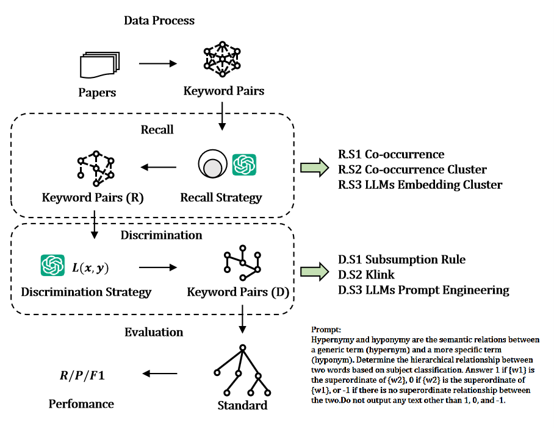

# Can Large Language Models Accurately Discriminate Subject Term Hierarchical Relationship?

## Subject Terms Recall

**R.S1 Co-occurrence**: count the co-occurrence relationships in author keywords, and when the frequency of keyword co-occurrence pairs is greater than the retrieval year interval (14 years), the two keywords in the keyword co-occurrence pairs are used as candidate subject term pairs.

****R.S2 Co-occurrence Cluster**: construct the co-occurrence frequency matrix of author keywords on the basis of R.S1, use this matrix to perform K-Means clustering, select the K value corresponding to the inflection point of the SSE curve as the number of clusters according to the principle of the elbow method, and then arrange and combine the keywords in each cluster according to the Cn2 permutation and take them as candidate subject term pairs.

**R.S3 LLMs Embedding Cluster**: also based on R.S1, the embedding vectors of the author's keywords are obtained by using a language model with a smaller number of parameters after distillation, and the candidate subject term pairs are obtained after the LLM characterization is recalled according to the clustering and permutation methods in R.S2.

## Hierarchical Relationship Discrimination

**D.S1 Subsumption Rule**: For keyword x and keyword y of a candidate subject term pair, P(x|y) and P(y|x) are computed, and x is the superlative of y when P(x|y)=1 and P(y|x)<1. Usually, the condition P(x|y)=1 is relaxed to P(x|y)>alpha, and alpha is chosen according to different domains and data sizes, usually 0.8.

**D.S2 Klink**: semantic features are introduced on the basis of D.S1 to compute L(x,y)=(P(x|y) - P(y|x)) * c(x,y) * (1 + N(x,y)). c(x,y) denotes the cosine similarity of keywords x and y in the co-occurrence matrix, and N(x,y) denotes the string similarity of keywords x and y. In this study, the longest common subsequence distance (LCS) is used. x is the superordinate of y for L(x,y)>t, and t is usually taken as 0.2.

**D.S3 LLMs Prompt Engineering**: the hierarchical relationship of each candidate subject term pair is discriminated by Prompt Engineering. The Prompt template designed in this study is as follows:

`Hypernymy and hyponymy are the semantic relations between a generic term (hypernym) and a more specific term (hyponym). Determine the hierarchical relationship between two words based on subject classification. Answer 1 if {w1} is the superordinate of {w2}, 0 if {w2} is the superordinate of {w1}, or -1 if there is no superordinate relationship between the two.Do not output any text other than 1, 0, and -1.`

## Experiments
Updated 03-13-25

|   **Phase**    | **Strategy** |                     | **OpenAlex** |           |           |  **CSO**   |           |            |
|:--------------:|:------------:|:-------------------:|:------------:|:---------:|:---------:|:----------:|:---------:|:----------:|
|                |              |                     |      P       |     R     |    F1     |     P      |     R     |     F1     |
|     Recall     |     R.S1     |       screen        |    33.51%    |   1.05%   |   2.04%   |   33.22%   |   2.83%   |   5.22%    |
|                |     R.S2     |    qw32b-cluster    |    4.61%     |   0.08%   |   0.16%   |   3.19%    |   0.15%   |   0.29%    |
|                |     R.S3     |     co-cluster      |    2.58%     |   0.05%   |   0.09%   |   2.29%    |   0.12%   |   0.22%    |
| Discrimination |     D.S1     |     Subsumption     |    4.05%     |   2.36%   |   2.99%   |   3.45%    |   5.44%   |   4.22%    |
|                |     D.S2     |        Klink        |    24.29%    |   1.25%   |   2.38%   |   25.68%   |   3.57%   |   6.27%    |
|                |     D.S3     |     qwen2.5:7b      |    20.65%    |   2.72%   |   4.80%   |   17.72%   |   6.29%   |   9.28%    |
|                |     D.S3     |   **qwen2.5:32b**   |    49.39%    |   3.04%   |   5.73%   |   39.34%   |   6.53%   |   11.19%   |
|                |     D.S3     |   **qwen2.5:72b**   |    51.42%    | **3.10%** | **5.85%** |   42.49%   | **6.91%** | **11.88%** |
|                |     D.S3     |     llama3.2:3b     |    45.75%    |   0.48%   |   0.96%   |   48.50%   |   1.38%   |   2.69%    |
|                |     D.S3     |    llama3.1:70b     |    31.98%    |   2.08%   |   3.90%   |   24.77%   |   4.34%   |   7.39%    |
|                |     D.S3     |   deepseek-r1:7b    |    25.51%    |   0.49%   |   0.97%   |   27.18%   |   1.41%   |   2.69%    |
|                |     D.S3     |       glm4:9b       |    43.72%    |   0.82%   |   1.61%   |   40.69%   |   2.06%   |   3.92%    |
|                |     D.S3     |    llama3.3:70b     |    55.06%    |   1.21%   |   2.37%   |   50.00%   |   2.97%   |   5.61%    |
|                |     D.S3     | **deepseek-r1:32b** |  **64.78%**  |   2.05%   |   3.98%   |   52.55%   |   4.49%   |   8.28%    |
|                |     D.S3     | **deepseek-r1:70b** |    62.35%    |   1.80%   |   3.51%   | **53.75%** |   4.20%   |   7.78%    |
